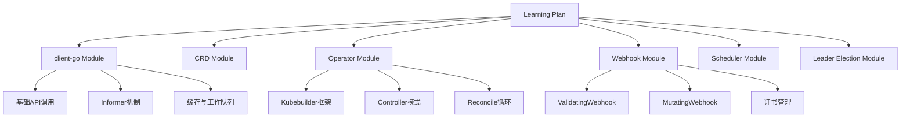

## 产品概述

为有 K8s 使用经验的开发者设计的系统化学习计划项目，涵盖 client-go、CRD、Operator、Webhook、Scheduler Extender、Leader Election 等核心二次开发技能。

## 核心功能

- Client-go 基础与进阶（Informer 工作机制、缓存机制）
- CRD 自定义资源定义与实现
- Operator 开发（使用 Kubebuilder、Operator SDK）
- Admission Webhook 开发（Validating/Mutating）
- Scheduler Extender 扩展调度器
- Leader Election 选举机制
- 实战案例与代码示例
- 学习进度追踪与评估

## 技术栈

- 开发语言: Go 1.21+
- K8s API: client-go v0.28+
- Operator 框架: Kubebuilder v4.0+, Operator SDK v1.30+
- 代码生成: controller-gen, controller-tools
- Webhook: Cert-Manager, Kustomize
- 调度器: Go scheduler extender 接口
- 测试: Ginkgo, Gomega, envtest
- 工具: kind, kubectl, helm

## 技术架构

### 系统架构

学习项目采用模块化架构，每个技术方向为独立模块，通过示例代码串联。核心架构遵循 K8s 官方最佳实践。



### 模块划分

- **client-go 模块**: 封装 K8s API 客户端操作，演示 Informer、WorkQueue、SharedInformerFactory 核心组件
- **CRD 模块**: 自定义资源定义、CRD 版本管理、结构化 Schema 定义
- **Operator 模块**: 基于 Kubebuilder 搭建 Operator 项目、Controller 开发、Reconcile 业务逻辑实现
- **Webhook 模块**: Admission Webhook 服务开发、证书自动配置、请求/响应处理
- **Scheduler Extender 模块**: 调度器扩展接口实现、优先级与过滤算法、与 K8s 调度器集成
- **Leader Election 模块**: 租约锁机制、选主逻辑、高可用架构实现

### 数据流

学习流程: 理论学习 → 代码示例 → 本地实践 → 集群部署 → 功能验证 → 进度记录

## 实现细节

### 核心目录结构

```
kubernetes-examples/
├── 01-client-go/
│   ├── basic/              # 基础 API 调用示例
│   ├── informer/           # Informer 机制示例
│   ├── workqueue/          # 工作队列示例
│   └── shared-informer/    # SharedInformerFactory 示例
├── 02-crd/
│   ├── simple-crd/         # 简单 CRD 定义
│   ├── versioned-crd/      # 多版本 CRD
│   └── status-subresource/ # Status 子资源
├── 03-operator/
│   ├── pod-operator/       # Pod 管理 Operator
│   ├── deployment-operator/# Deployment 扩展 Operator
│   └── custom-resource-op/ # 自定义资源 Operator
├── 04-webhook/
│   ├── validating/         # Validating Webhook
│   ├── mutating/          # Mutating Webhook
│   └── cert-manager/      # 证书管理配置
├── 05-scheduler-extender/
│   ├── filter/             # 过滤插件
│   ├── priority/           # 优先级插件
│   └── bind/               # 绑定插件
├── 06-leader-election/
│   ├── lease-lock/         # Lease 锁实现
│   ├── endpoint-lock/      # Endpoint 锁实现
│   └── configmap-lock/     # ConfigMap 锁实现
├── learning-path/          # 学习路线文档
├── examples/               # 综合实战案例
└── scripts/                # 部署和管理脚本
```

### 关键代码结构

- **Client-Go Informer**: SharedInformerFactory → Informer → EventHandler → WorkQueue
- **Operator Controller**: SetupWithManager → Reconcile → Status Update → Event Recording
- **Webhook Handler**: AdmissionReview 解析 → 校验/修改逻辑 → AdmissionResponse 返回
- **Scheduler Extender**: Filter 接口 → Priority 接口 → Bind 接口 → HTTP 服务

### 技术实施计划

每个模块包含: README 文档、完整代码示例、Makefile、kustomize 配置、测试用例

### 集成点

- 使用 kind 本地集群进行测试
- 使用 helm 打包部署示例应用
- 使用 GitHub Actions 自动化测试流程

## Agent Extensions

### SubAgent

- **code-explorer**
- 用途: 探索和分析现有的 k8s-examples 项目结构，了解已有代码示例，避免重复开发
- 预期结果: 获取项目完整结构、识别缺失的学习模块、提取可复用的代码模式