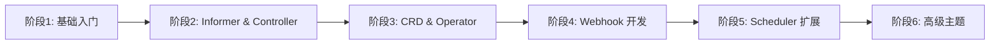

# Kubernetes 二次开发学习路径

> 适合有 K8s 使用经验的开发者，系统学习 K8s 二次开发技能
> 预计学习周期：8-10 周（每天 4+ 小时）

## 📚 学习路径概览



## 阶段 1: 基础入门（1-2 周）

### 学习目标
- 搭建本地 K8s 测试环境
- 理解 client-go 核心概念
- 掌握基础 API 调用

### 学习内容

#### 1.1 环境搭建
**文件**: `kind/kind-config.yaml`

```bash
# 安装 kind
curl -Lo ./kind https://kind.sigs.k8s.io/dl/v0.20.0/kind-darwin-amd64
chmod +x ./kind
sudo mv ./kind /usr/local/bin/

# 创建集群
kind create cluster --config=kind/kind-config.yaml

# 验证
kubectl cluster-info
```

**学习要点**:
- Kind 双栈网络配置
- 自定义 DNS 域名
- kube-proxy IPVS 模式

#### 1.2 Client-go Hello World
**文件**: `client-go/helloworld/main.go`

```bash
cd client-go/helloworld
go run main.go
```

**学习要点**:
- client-go 配置加载（in-cluster vs kubeconfig）
- ClientSet 初始化
- 简单的 List/Get 操作

#### 1.3 ClientSet 基础操作
**文件**: `client-go/using-kubernetes-clientset/`

```bash
# 创建 Deployment
cd client-go/using-kubernetes-clientset
go run creating_deployment.go

# 更新镜像
go run updating_deployment_image.go

# 删除 Deployment
go run deleting_deployment.go

# 列出 Pod
go run listing_pods.go
```

**学习要点**:
- Deployment CRUD 完整流程
- Pod 列表和筛选
- 错误处理和重试机制

#### 1.4 RESTClient 使用
**文件**: `client-go/using-rest-client/`

```bash
cd client-go/using-rest-client
go run creating_deployment.go
go run listing_pods.go
```

**学习要点**:
- RESTClient vs ClientSet 区别
- 底层 HTTP 调用
- 请求/响应处理

#### 1.5 Discovery Client
**文件**: `client-go/using-discovery-client/`

```bash
cd client-go/using-discovery-client
go run discovery_client.go
go run cached_discovery_client.go
```

**学习要点**:
- API 资源发现
- 版本和 GVR 获取
- 缓存 Discovery Client

#### 1.6 Dynamic Client
**文件**: `client-go/using-dynamic-interface/`

```bash
# 列出 Pod
cd client-go/using-dynamic-interface/list-pod
go run main.go

# 创建 Pod
cd ../create-pod
go run main.go

# 获取和更新 CRD
cd ../get-and-update-crds
go run main.go
```

**学习要点**:
- 非类型化资源操作
- Unstructured 类型
- CRD 动态操作

### 阶段 1 总结
✅ 理解 client-go 四种客户端
✅ 掌握基础 CRUD 操作
✅ 熟悉 K8s API 资源模型

---

## 阶段 2: Informer 与 Controller（2 周）

### 学习目标
- 理解 Informer 工作机制
- 掌握 Reflector、DeltaFIFO、WorkQueue
- 实现自定义 Controller

### 学习内容

#### 2.1 Reflector 机制
**文件**: `client-go/using-reflector/main.go`

```bash
cd client-go/using-reflector
go run main.go
```

**学习要点**:
- Watch/List API 调用
- 资源同步到本地 Store
- Resync 机制

#### 2.2 DeltaFIFO 队列
**文件**: `client-go/using-deltafifo/main.go`

```bash
cd client-go/using-deltafifo
go run main.go
```

**学习要点**:
- Delta 类型（Added/Updated/Deleted）
- FIFO 顺序保证
- Pop 处理机制

#### 2.3 Controller 模式
**文件**: `client-go/using-controller/main.go`

```bash
cd client-go/using-controller
go run main.go
```

**学习要点**:
- Controller 核心循环
- Reflector + DeltaFIFO + WorkQueue 集成
- 事件处理流程

#### 2.4 WorkQueue 深度使用
**文件**: `client-go/workqueue/main.go`

```bash
cd client-go/workqueue
go run main.go
```

**学习要点**:
- RateLimitingQueue 限流
- Add/Get/Done 完整流程
- 错误重试机制
- 队列去重

#### 2.5 Informer 机制
**文件**: `client-go/using-informers/`

##### 2.5.1 Typed Informer
```bash
cd client-go/using-informers/informer-typed-simple
go run main.go
```

**学习要点**:
- SharedInformerFactory 使用
- 事件处理器注册
- Lister 缓存查询

##### 2.5.2 Generic Informer
```bash
cd ../informer-generic-simple
go run main.go
```

**学习要点**:
- 泛型 Informer
- 适用于非结构化资源

##### 2.5.3 Dynamic Informer
```bash
cd ../informer-dynamic-simple
go run main.go
```

**学习要点**:
- 动态 Informer
- CRD 监听

### 阶段 2 总结
✅ 理解 Informer 完整工作机制
✅ 掌握 Controller 模式
✅ 熟悉 WorkQueue 限流和重试

---

## 阶段 3: CRD 与 Operator（2 周）

### 学习目标
- 理解 CRD 定义
- 掌握代码生成工具
- 开发完整 Operator

### 学习内容

#### 3.1 CRD 基础
**文件**: `kubernetes-plugins/api/crd/`

```bash
# 查看 CRD 定义
cat kubernetes-plugins/api/crd/resourcedefinition.yaml

# 应用 CRD
kubectl apply -f kubernetes-plugins/api/crd/resourcedefinition.yaml

# 查看 CRD
kubectl get crd
```

**学习要点**:
- CRD 规范和 Schema
- 版本管理
- Status 子资源

#### 3.2 代码生成
**文件**: `resourcedefinition/`

```bash
cd resourcedefinition

# 生成 ClientSet
client-gen -v 10 --go-header-file ./boilerplate.go.txt \
  --output-dir ./generated/clientset \
  --output-pkg=github.com/onexstack/kubernetes-examples/resourcedefinition/generated/clientset \
  --clientset-name=versioned \
  --input-base= \
  --input $PWD/apps/v1beta1

# 生成 DeepCopy
deepcopy-gen -v 10 --go-header-file ./boilerplate.go.txt \
  --output-file zz_generated.deepcopy.go ./apps/v1beta1

# 生成 Default
defaulter-gen -v 1 --go-header-file ./boilerplate.go.txt \
  --output-file zz_generated.defaults.go ./apps/v1beta1/
```

**学习要点**:
- client-gen、deepcopy-gen、defaulter-gen
- 自动生成代码结构
- Boilerplate 文件规范

#### 3.3 API Version 兼容性
**文件**: `apiversioncompatibility/main.go`

```bash
cd apiversioncompatibility
go run main.go
```

**学习要点**:
- API 版本转换
- 参数兼容性处理
- 向后兼容策略

#### 3.4 Operator 框架选择

**现有项目**: `webhook/using-kubebuilder/`

```bash
cd webhook/using-kubebuilder

# 查看 API 定义
ls api/v1/

# 查看 Controller
cat internal/controller/calculate_controller.go

# 查看 Webhook
cat api/v1/calculate_webhook.go
```

**学习要点**:
- Kubebuilder 项目结构
- CRD 定义和标记
- Reconcile 循环
- Webhook 集成

#### 3.5 完整 Operator 示例（需补充）
**建议补充内容**:
- Pod Operator：管理 Pod 生命周期
- Deployment Operator：扩展 Deployment 功能
- 带 Finalizer 的 Operator：资源清理

**实现要点**:
- Reconcile 状态机
- Status 更新
- Event 记录
- OwnerReference
- Finalizer 处理

### 阶段 3 总结
✅ 掌握 CRD 定义
✅ 熟悉代码生成工具
✅ 理解 Operator 模式

---

## 阶段 4: Webhook 开发（1-2 周）

### 学习目标
- 理解 Admission Webhook 工作原理
- 掌握 Validating 和 Mutating Webhook
- 学习证书管理

### 学习内容

#### 4.1 By-hand Webhook（理解原理）
**文件**: `webhook/using-byhand/by-service/`

##### 4.1.1 生成证书
```bash
cd webhook/using-byhand/by-service

# 生成证书
./certgen.sh

# 查看证书
ls -la certs/
```

**学习要点**:
- TLS 证书生成
- CA、服务器证书、私钥
- Subject Alternative Names

##### 4.1.2 部署 Webhook
```bash
# 应用 Secret
kubectl apply -f certs-secret.yaml

# 应用 Deployment 和 Service
kubectl apply -f deployment.yaml
kubectl apply -f service.yaml

# 应用 MutatingWebhookConfiguration
kubectl apply -f mutatingwebhookconfiguration.yaml

# 应用 ValidatingWebhookConfiguration
kubectl apply -f validatingwebhookconfiguration.yaml

# 验证
kubectl get mutatingwebhookconfiguration
kubectl get validatingwebhookconfiguration
```

**学习要点**:
- Webhook 服务部署
- Service 和 Ingress 配置
- WebhookConfiguration 定义
- NamespaceSelector、ObjectSelector

##### 4.1.3 测试 Webhook
```bash
# 测试 Mutating Webhook
kubectl apply -f sleep-with-labels.yaml
kubectl apply -f sleep-without-labels.yaml

# 测试 Validating Webhook
kubectl apply -f valid-pod.yaml
kubectl apply -f invalid-pod.yaml

# 查看 Pod（验证是否被修改）
kubectl get pods
kubectl describe pod <pod-name>
```

**学习要点**:
- AdmissionReview 请求格式
- AdmissionResponse 响应格式
- JSON Patch 操作
- 验证失败处理

##### 4.1.4 查看代码
**文件**: `webhook/using-byhand/by-service/webhook.go`

```bash
# 查看 Mutating Webhook 实现
grep -A 50 "mutate" webhook/using-byhand/by-service/webhook.go

# 查看 Validating Webhook 实现
grep -A 30 "validate" webhook/using-byhand/by-service/webhook.go
```

**学习要点**:
- HTTP Handler 实现
- AdmissionReview 解析
- JSON Patch 生成
- 错误处理

#### 4.2 Kubebuilder Webhook（快速开发）
**文件**: `webhook/using-kubebuilder/`

##### 4.2.1 项目结构
```bash
cd webhook/using-kubebuilder

tree -L 3
```

**学习要点**:
- Kubebuilder 标准结构
- API、Controller、Config 目录
- Makefile 目标

##### 4.2.2 API 和 Webhook 定义
**文件**: `webhook/using-kubebuilder/api/v1/calculate_types.go`
**文件**: `webhook/using-kubebuilder/api/v1/calculate_webhook.go`

```bash
# 查看 CRD 定义
cat api/v1/calculate_types.go

# 查看 Webhook 标记
grep -A 10 "kubebuilder:webhook" api/v1/calculate_webhook.go

# 查看 Webhook 实现
cat api/v1/calculate_webhook.go
```

**学习要点**:
- CRD 标记
- Webhook 标记
- Default、Validate、ValidateCreate、ValidateUpdate

##### 4.2.3 部署
```bash
cd webhook/using-kubebuilder

# 安装 CRD
make install

# 部署到集群
make deploy IMG=your-registry/webhook:latest

# 查看 Pod
kubectl get pods -n webhook-system
```

**学习要点**:
- Makefile 使用
- Manifests 生成
- RBAC 配置
- Cert-manager 集成

##### 4.2.4 测试
```bash
# 创建测试资源
kubectl apply -f config/samples/

# 查看
kubectl get calculate
kubectl describe calculate <name>
```

#### 4.3 By-baremetal Webhook（纯手动实现）
**文件**: `webhook/using-byhand/by-baremetal/`

```bash
cd webhook/using-byhand/by-baremetal
go run main.go
```

**学习要点**:
- 不依赖 Service 的实现
- 纯 TLS + HTTP
- 适合离线环境

### 阶段 4 总结
✅ 理解 Webhook 工作原理
✅ 掌握两种实现方式
✅ 熟悉证书管理

---

## 阶段 5: Scheduler 扩展（1-2 周）

### 学习目标
- 理解 Scheduler Extender 架构
- 掌握 Filter、Priority、Bind 扩展点
- 实现自定义调度策略

### 学习内容

#### 5.1 Scheduler Extender 概述
**文档**: `kubescheduler-sourcetree/v1.31.1/comprehensive.md`

```bash
# 查看源码分析
cat kubescheduler-sourcetree/v1.31.1/comprehensive.md
```

**学习要点**:
- Scheduler Framework 插件体系
- 扩展点分类
- 调度流程

#### 5.2 Scheduler Extender 实现
**文件**: `k8s-scheduler-extender-example/`

##### 5.2.1 项目结构
```bash
cd k8s-scheduler-extender-example
ls -la
```

**文件说明**:
- `main.go`: HTTP 服务器入口
- `routes.go`: 路由处理
- `bind.go`: Pod 绑定逻辑
- `predicate.go`: Filter 逻辑
- `prioritize.go`: Priority 逻辑
- `preemption.go`: 抢占逻辑
- `extender.yaml`: Scheduler 策略配置

##### 5.2.2 构建镜像
```bash
cd k8s-scheduler-extender-example

# 构建镜像
docker build -t my-scheduler-extender:latest .

# 推送镜像
docker tag my-scheduler-extender:latest your-registry/my-scheduler-extender:latest
docker push your-registry/my-scheduler-extender:latest
```

##### 5.2.3 部署 Extender
```bash
# 替换镜像地址
sed 's/YOUR_ORG\/YOUR_IMAGE:YOUR_TAG/your-registry\/my-scheduler-extender:latest/' extender.yaml | kubectl apply -f -

# 查看 Scheduler Pod
kubectl get pods -n kube-system -l component=my-scheduler

# 查看日志
kubectl logs -n kube-system -l component=my-scheduler -c my-scheduler-extender-ctr -f
```

##### 5.2.4 查看配置
**文件**: `k8s-scheduler-extender-example/extender.yaml`

```bash
# 查看 Scheduler 策略
cat k8s-scheduler-extender-example/extender.yaml
```

**学习要点**:
- extender 配置格式
- Filter、Prioritize、Bind、Preemption URL
- 节点优先级配置

##### 5.2.5 测试调度
```bash
# 创建测试 Pod
kubectl apply -f test-pod.yaml

# 查看 Pod 调度情况
kubectl get pod test-pod -o wide
kubectl describe pod test-pod
```

**学习要点**:
- Scheduler 名称指定
- 调度事件
- 调度失败排查

##### 5.2.6 代码分析

**Filter 实现** (`predicate.go`):
```go
func (h *ExtenderHandler) Predicate(args schedulerapi.ExtenderPredicateArgs) (*schedulerapi.ExtenderPredicateResult, error)
```
- 节点过滤逻辑
- 返回符合条件节点

**Priority 实现** (`prioritize.go`):
```go
func (h *ExtenderHandler) Prioritize(args schedulerapi.ExtenderPrioritizeArgs) (*schedulerapi.HostPriorityList, error)
```
- 节点打分逻辑
- 返回每个节点得分

**Bind 实现** (`bind.go`):
```go
func (h *ExtenderHandler) Bind(args schedulerapi.ExtenderBindingArgs) (*schedulerapi.ExtenderBindingResult, error)
```
- Pod 绑定到节点
- 调用 API Server

### 阶段 5 总结
✅ 理解 Scheduler 架构
✅ 掌握 Extender 开发
✅ 熟悉扩展点使用

---

## 阶段 6: 高级主题（1 周）

### 学习目标
- 理解 Leader Election 机制
- 掌握 Finalizer 和资源清理
- 理解 OwnerReference 和级联删除

### 学习内容

#### 6.1 Leader Election
**文件**: `leader-election/`

##### 6.1.1 标准 Leader Election
```bash
cd leader-election

# Terminal 1
go run main.go -kubeconfig=$HOME/.kube/config \
  -lease-lock-name=example \
  -lease-lock-namespace=default \
  -id=1

# Terminal 2
go run main.go -kubeconfig=$HOME/.kube/config \
  -lease-lock-name=example \
  -lease-lock-namespace=default \
  -id=2

# Terminal 3
go run main.go -kubeconfig=$HOME/.kube/config \
  -lease-lock-name=example \
  -lease-lock-namespace=default \
  -id=3
```

**学习要点**:
- Lease Lock 机制
- OnStartedLeading 回调
- OnStoppedLeading 回调
- 高可用架构

##### 6.1.2 Redis Leader Election
**文件**: `leader-election/redislock.go`

```bash
# 启动 Redis（Docker）
docker run -d -p 6379:6379 redis:7

# Terminal 1
go run main.go -redis=localhost:6379 -id=1

# Terminal 2
go run main.go -redis=localhost:6379 -id=2

# Terminal 3
go run main.go -redis=localhost:6379 -id=3
```

**学习要点**:
- 基于 Redis 的分布式锁
- Lock 接口实现
- 续租机制
- 多副本部署

##### 6.1.3 查看代码
**文件**: `leader-election/redislock/redislock.go`

```bash
# 查看 RedisLock 实现
cat leader-election/redislock/redislock.go

# 查看 LeaderElection 使用
grep -A 50 "leaderelection" leader-election/main.go
```

**学习要点**:
- Lock 接口方法（Get、Create、Update）
- LeaderElectionConfig 配置
- LeaseDuration、RenewDeadline、RetryPeriod

#### 6.2 Finalizer（需补充）
**学习要点**:
- Finalizer 作用机制
- 资源清理流程
- DeletionTimestamp 检查
- 模式：PreHook → 处理 → 移除 Finalizer

#### 6.3 OwnerReference（需补充）
**学习要点**:
- OwnerReference 定义
- 级联删除机制
- Controller 设置
- 孤儿资源处理

#### 6.4 Feature Gates
**文件**: `featuregates/main.go`

```bash
cd featuregates
go run main.go
```

**学习要点**:
- Feature Gate 使用
- 命令行参数
- 动态功能开关

### 阶段 6 总结
✅ 掌握 Leader Election
✅ 理解资源清理机制
✅ 熟悉功能门控

---

## 附录

### A. 项目结构速查

```
kubernetes-examples/
├── client-go/                 # Client-go 示例（33+ 个）
│   ├── helloworld/           # Hello World
│   ├── using-kubernetes-clientset/  # ClientSet CRUD
│   ├── using-rest-client/    # RESTClient
│   ├── using-discovery-client/      # Discovery Client
│   ├── using-dynamic-interface/   # Dynamic Client
│   ├── using-reflector/      # Reflector
│   ├── using-deltafifo/      # DeltaFIFO
│   ├── using-controller/     # Controller
│   ├── workqueue/            # WorkQueue
│   └── using-informers/      # Informer 系列
├── webhook/                   # Webhook 示例
│   ├── using-byhand/         # 手动实现
│   │   ├── by-service/       # Service 方式
│   │   └── by-baremetal/     # 纯 HTTP
│   └── using-kubebuilder/    # Kubebuilder 框架
├── leader-election/           # Leader Election
│   ├── main.go               # 标准实现
│   └── redislock/            # Redis 实现
├── k8s-scheduler-extender-example/  # Scheduler 扩展
├── resourcedefinition/        # CRD 和代码生成
├── kubernetes-plugins/        # 插件示例
│   └── api/
│       ├── crd/             # CRD 定义
│       └── aggregated-apiserver/  # 聚合 API Server
├── kubescheduler-sourcetree/  # Scheduler 源码分析
├── kind/                      # Kind 配置
├── featuregates/             # Feature Gates
├── apiversioncompatibility/   # API 版本兼容
└── template/                  # 模板和示例
```

### B. 依赖工具安装

```bash
# Go 1.22+
go version

# Kind
curl -Lo ./kind https://kind.sigs.k8s.io/dl/v0.20.0/kind-darwin-amd64
chmod +x ./kind
sudo mv ./kind /usr/local/bin/

# kubectl
curl -LO https://dl.k8s.io/release/v1.30.0/bin/darwin/amd64/kubectl
chmod +x kubectl
sudo mv kubectl /usr/local/bin/

# Kubebuilder
go install sigs.k8s.io/kubebuilder/v4/cmd/kubebuilder@latest

# Controller-gen
go install sigs.k8s.io/controller-tools/cmd/controller-gen@latest

# Client-gen
go install k8s.io/code-generator/cmd/client-gen@latest

# Deepcopy-gen
go install k8s.io/code-generator/cmd/deepcopy-gen@latest

# Defaulter-gen
go install k8s.io/code-generator/cmd/defaulter-gen@latest
```

### C. 常见问题

**Q: 如何调试 Webhook？**
A:
```bash
# 查看 Webhook 日志
kubectl logs -n webhook-system deployment/webhook-controller-manager

# 查看 AdmissionReview 请求
# 在 Webhook Handler 中添加日志打印
```

**Q: 如何测试 Scheduler Extender？**
A:
```bash
# 查看调度事件
kubectl describe pod <pod-name>

# 查看 Scheduler 日志
kubectl logs -n kube-system my-scheduler-xxx
```

**Q: Informer 缓存不一致怎么办？**
A:
```go
// 等待缓存同步
informerFactory.WaitForCacheSync(stopCh)

// 强制重新同步
informer.AddEventHandler(cache.ResourceEventHandlerFuncs{
    AddFunc: func(obj interface{}) {
        // 处理
    },
})
```

### D. 推荐资源

- [Kubernetes 官方文档](https://kubernetes.io/docs/home/)
- [client-go 官方文档](https://github.com/kubernetes/client-go)
- [Kubebuilder 书籍](https://book.kubebuilder.io/)
- [Kubernetes API 参考](https://kubernetes.io/docs/reference/kubernetes-api/)

---

**最后更新**: 2025-12-28
**维护者**: kubernetes-examples 项目团队
