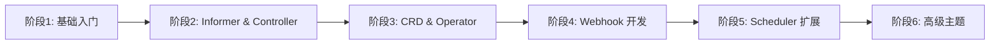

# Kubernetes 二次开发实战示例

> 适合有 K8s 使用经验的开发者，系统学习 K8s 二次开发技能

## 📚 项目简介

这是一个完整的 Kubernetes 二次开发学习资源库，包含丰富的实战示例和详细的学习文档。通过本项目的学习，你将掌握 client-go、CRD、Operator、Webhook、Scheduler 扩展等 K8s 二次开发的核心技能。

## 🎯 学习目标

- ✅ 掌握 client-go 四种客户端的使用
- ✅ 理解 Informer、Controller 工作机制
- ✅ 开发完整的 CRD 和 Operator
- ✅ 实现 Admission Webhook
- ✅ 扩展 Kubernetes Scheduler
- ✅ 掌握 Leader Election 等高级特性

## 📖 学习路径

本项目的学习路径分为 6 个阶段，预计需要 8-10 周（每天 4+ 小时）：



详细学习路径请查看：[LEARNING_PATH.md](./LEARNING_PATH.md)

## 🗂️ 项目结构

```
kubernetes-examples/
├── client-go/                      # Client-go 示例（33+ 个）
│   ├── helloworld/                # Hello World 入门
│   ├── using-kubernetes-clientset/ # ClientSet CRUD 操作
│   ├── using-rest-client/         # RESTClient 使用
│   ├── using-discovery-client/     # Discovery Client
│   ├── using-dynamic-interface/    # Dynamic Client
│   ├── using-reflector/           # Reflector 机制
│   ├── using-deltafifo/           # DeltaFIFO 队列
│   ├── using-controller/          # Controller 模式
│   ├── workqueue/                # WorkQueue 使用
│   └── using-informers/          # Informer 系列
├── webhook/                       # Webhook 示例
│   ├── using-byhand/             # 手动实现
│   │   ├── by-service/           # Service 方式
│   │   └── by-baremetal/       # 纯 HTTP 方式
│   └── using-kubebuilder/        # Kubebuilder 框架
├── leader-election/               # Leader Election
│   └── redislock/                # Redis 分布式锁实现
├── k8s-scheduler-extender-example/ # Scheduler 扩展
├── resourcedefinition/           # CRD 和代码生成
├── pod-operator/                # 完整 Operator 示例
├── finalizer-example/            # Finalizer 使用示例
├── ownerreference-example/        # OwnerReference 使用示例
├── kubernetes-plugins/           # 插件示例
│   └── api/
│       ├── crd/                 # CRD 定义
│       └── aggregated-apiserver/ # 聚合 API Server
├── kubescheduler-sourcetree/     # Scheduler 源码分析
├── kind/                        # Kind 集群配置
├── featuregates/               # Feature Gates 示例
├── apiversioncompatibility/      # API 版本兼容
├── helper/                     # 辅助工具
└── template/                   # 模板和示例
```

## 🚀 快速开始

### 1. 环境准备

#### 安装依赖工具

```bash
# Go 1.22+
go version

# Kind
curl -Lo ./kind https://kind.sigs.k8s.io/dl/v0.20.0/kind-darwin-amd64
chmod +x ./kind
sudo mv ./kind /usr/local/bin/

# kubectl
curl -LO https://dl.k8s.io/release/v1.30.0/bin/darwin/amd64/kubectl
chmod +x kubectl
sudo mv kubectl /usr/local/bin/

# Kubebuilder
go install sigs.k8s.io/kubebuilder/v4/cmd/kubebuilder@latest

# Controller-gen
go install sigs.k8s.io/controller-tools/cmd/controller-gen@latest
```

#### 创建 Kind 集群

```bash
# 创建本地 K8s 测试集群
kind create cluster --config=kind/kind-config.yaml

# 验证集群
kubectl cluster-info
kubectl get nodes
```

### 2. 运行第一个示例

#### Client-go Hello World

```bash
# 创建测试 Deployment
docker pull nginx:alpine
kind load docker-image nginx:alpine --name onex
kubectl create deployment demo-deployment --image=nginx:alpine --replicas=3

# 运行示例
cd client-go/helloworld
go run main.go

# 验证结果
kubectl get deployments
```

详细说明请查看：[client-go/helloworld/README.md](./client-go/helloworld/README.md)

## 📚 详细学习资源

### 阶段 1: 基础入门（1-2 周）

- [client-go Hello World](./client-go/helloworld/)
- [ClientSet 基础操作](./client-go/using-kubernetes-clientset/)
- [RESTClient 使用](./client-go/using-rest-client/)
- [Discovery Client](./client-go/using-discovery-client/)
- [Dynamic Client](./client-go/using-dynamic-interface/)

### 阶段 2: Informer 与 Controller（2 周）

- [Reflector 机制](./client-go/using-reflector/)
- [DeltaFIFO 队列](./client-go/using-deltafifo/)
- [Controller 模式](./client-go/using-controller/)
- [WorkQueue 深度使用](./client-go/workqueue/)
- [Informer 机制](./client-go/using-informers/)

### 阶段 3: CRD 与 Operator（2 周）

- [CRD 基础](./kubernetes-plugins/api/crd/)
- [代码生成](./resourcedefinition/)
- [完整 Operator 示例](./pod-operator/)
- [API Version 兼容性](./apiversioncompatibility/)

### 阶段 4: Webhook 开发（1-2 周）

- [By-hand Webhook](./webhook/using-byhand/by-service/)
- [Kubebuilder Webhook](./webhook/using-kubebuilder/)
- [By-baremetal Webhook](./webhook/using-byhand/by-baremetal/)

### 阶段 5: Scheduler 扩展（1-2 周）

- [Scheduler Extender 实现](./k8s-scheduler-extender-example/)
- [Scheduler 源码分析](./kubescheduler-sourcetree/)

### 阶段 6: 高级主题（1 周）

- [Leader Election](./leader-election/)
- [Finalizer 使用](./finalizer-example/)
- [OwnerReference 使用](./ownerreference-example/)
- [Feature Gates](./featuregates/)

## 🎓 学习建议

### 学习顺序

1. **从基础开始**：建议按照 `LEARNING_PATH.md` 的顺序学习
2. **理论结合实践**：每个示例都包含详细代码和文档
3. **动手实验**：在本地 Kind 集群中运行所有示例
4. **深入理解**：阅读源码，理解底层实现

### 学习方法

- **阅读文档**：先理解概念和原理
- **运行代码**：通过实际运行验证理解
- **修改代码**：尝试修改参数，观察结果变化
- **扩展功能**：基于示例开发自己的功能

## 🔧 常见问题

### Q: 如何调试 Webhook？

A:
```bash
# 查看 Webhook 日志
kubectl logs -n webhook-system deployment/webhook-controller-manager

# 查看 AdmissionReview 请求
# 在 Webhook Handler 中添加日志打印
```

### Q: 如何在 Kind 中使用自定义镜像？

A:
```bash
# 拉取镜像
docker pull <image>

# 加载到 Kind 节点
kind load docker-image <image> --name onex

# 在 Kubernetes 中使用
kubectl create deployment <name> --image=<image>
```

### Q: Informer 缓存不一致怎么办？

A:
```go
// 等待缓存同步
informerFactory.WaitForCacheSync(stopCh)

// 强制重新同步
informer.AddEventHandler(cache.ResourceEventHandlerFuncs{
    AddFunc: func(obj interface{}) {
        // 处理
    },
})
```

更多问题请查看：[LEARNING_PATH.md - 附录 C](./LEARNING_PATH.md#appendix-c-common-questions)

## 📚 推荐资源

- [Kubernetes 官方文档](https://kubernetes.io/docs/home/)
- [client-go 官方文档](https://github.com/kubernetes/client-go)
- [Kubebuilder 书籍](https://book.kubebuilder.io/)
- [Kubernetes API 参考](https://kubernetes.io/docs/reference/kubernetes-api/)
- [Operator Pattern](https://kubernetes.io/docs/concepts/extend-kubernetes/operator/)

## 🤝 贡献

欢迎提交 Issue 和 Pull Request！

### 贡献指南

1. Fork 本仓库
2. 创建特性分支 (`git checkout -b feature/AmazingFeature`)
3. 提交更改 (`git commit -m 'Add some AmazingFeature'`)
4. 推送到分支 (`git push origin feature/AmazingFeature`)
5. 提交 Pull Request

## 📄 许可证

本项目采用 MIT 许可证 - 详见 [LICENSE](LICENSE) 文件

---

**最后更新**: 2025-12-28

**维护者**: [ashwinyue](https://github.com/ashwinyue)

**项目地址**: https://github.com/ashwinyue/kubernetes-examples
