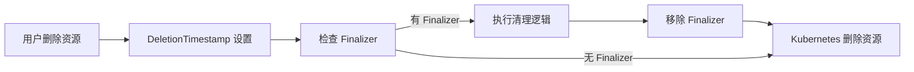

# Finalizer 示例

Finalizer 是 Kubernetes 中用于实现资源清理的重要机制。本示例展示如何在自定义 Controller 中使用 Finalizer。

## 什么是 Finalizer？

### 作用

Finalizer 用于确保资源被正确清理，防止孤儿资源。当资源被标记为删除（DeletionTimestamp 设置）但还有 Finalizer 时，Kubernetes 会阻止删除，直到所有 Finalizer 被移除。

### 工作流程



### 关键要点

1. **防止资源立即删除**：有 Finalizer 的资源不会立即被删除
2. **执行清理逻辑**：在 Finalizer 中执行清理操作（删除子资源、释放外部资源等）
3. **移除 Finalizer**：清理完成后移除 Finalizer
4. **资源真正删除**：所有 Finalizer 移除后，Kubernetes 才删除资源

## 示例代码

### 1. 添加 Finalizer

当创建资源时，添加 Finalizer：

```go
const finalizerName = "mycontroller.example.com/finalizer"

func (r *MyReconciler) Reconcile(ctx context.Context, req ctrl.Request) (ctrl.Result, error) {
    myObj := &mygroupv1.MyObject{}
    if err := r.Get(ctx, req.NamespacedName, myObj); err != nil {
        return ctrl.Result{}, client.IgnoreNotFound(err)
    }

    // 如果没有 Finalizer，添加它
    if !controllerutil.ContainsFinalizer(myObj, finalizerName) {
        controllerutil.AddFinalizer(myObj, finalizerName)
        if err := r.Update(ctx, myObj); err != nil {
            return ctrl.Result{}, err
        }
        // 重新入队，确保在下次 Reconcile 时处理
        return ctrl.Result{Requeue: true}, nil
    }

    // ... 正常逻辑
}
```

### 2. 处理删除

当资源被删除时，处理 Finalizer：

```go
func (r *MyReconciler) Reconcile(ctx context.Context, req ctrl.Request) (ctrl.Result, error) {
    myObj := &mygroupv1.MyObject{}
    if err := r.Get(ctx, req.NamespacedName, myObj); err != nil {
        return ctrl.Result{}, client.IgnoreNotFound(err)
    }

    // 检查是否正在删除
    if !myObj.DeletionTimestamp.IsZero() {
        // 资源被标记为删除，处理 Finalizer
        return r.handleDeletion(ctx, myObj)
    }

    // ... 正常逻辑
}

func (r *MyReconciler) handleDeletion(ctx context.Context, myObj *mygroupv1.MyObject) (ctrl.Result, error) {
    log := log.FromContext(ctx)

    // 检查是否有我们的 Finalizer
    if !controllerutil.ContainsFinalizer(myObj, finalizerName) {
        // 没有 Finalizer，直接返回，让 Kubernetes 删除资源
        return ctrl.Result{}, nil
    }

    // 1. 执行清理逻辑
    if err := r.cleanupResources(ctx, myObj); err != nil {
        log.Error(err, "Failed to cleanup resources")
        // 清理失败，稍后重试
        return ctrl.Result{RequeueAfter: time.Minute}, nil
    }

    // 2. 移除 Finalizer
    controllerutil.RemoveFinalizer(myObj, finalizerName)
    if err := r.Update(ctx, myObj); err != nil {
        return ctrl.Result{}, err
    }

    log.Info("Finalizer processed, resource will be deleted")
    return ctrl.Result{}, nil
}
```

### 3. 清理资源示例

```go
func (r *MyReconciler) cleanupResources(ctx context.Context, myObj *mygroupv1.MyObject) error {
    // 示例 1: 删除子资源（使用 OwnerReference）
    // 如果设置了 OwnerReference，Kubernetes 会自动删除
    // 但有时需要手动清理

    // 示例 2: 删除关联的 Pod
    podList := &corev1.PodList{}
    if err := r.List(ctx, podList,
        client.InNamespace(myObj.Namespace),
        client.MatchingLabels{"my-resource": myObj.Name},
    ); err != nil {
        return err
    }

    for _, pod := range podList.Items {
        if err := r.Delete(ctx, &pod); err != nil {
            if !errors.IsNotFound(err) {
                return err
            }
        }
    }

    // 示例 3: 清理外部资源（如云服务、数据库等）
    if err := r.cleanupExternalResources(ctx, myObj); err != nil {
        return err
    }

    return nil
}
```

### 4. 完整示例

```go
const finalizerName = "podmanager.example.com/finalizer"

func (r *PodManagerReconciler) Reconcile(ctx context.Context, req ctrl.Request) (ctrl.Result, error) {
    log := log.FromContext(ctx)

    // 1. 获取资源
    pm := &appsv1.PodManager{}
    if err := r.Get(ctx, req.NamespacedName, pm); err != nil {
        return ctrl.Result{}, client.IgnoreNotFound(err)
    }

    // 2. 处理删除
    if !pm.DeletionTimestamp.IsZero() {
        return r.handleFinalizer(ctx, pm)
    }

    // 3. 添加 Finalizer
    if !controllerutil.ContainsFinalizer(pm, finalizerName) {
        controllerutil.AddFinalizer(pm, finalizerName)
        if err := r.Update(ctx, pm); err != nil {
            return ctrl.Result{}, err
        }
        return ctrl.Result{Requeue: true}, nil
    }

    // 4. 正常 Reconcile 逻辑
    // ...

    return ctrl.Result{}, nil
}

func (r *PodManagerReconciler) handleFinalizer(ctx context.Context, pm *appsv1.PodManager) (ctrl.Result, error) {
    log := log.FromContext(ctx)

    if !controllerutil.ContainsFinalizer(pm, finalizerName) {
        return ctrl.Result{}, nil
    }

    // 清理 Pod
    podList := &corev1.PodList{}
    if err := r.List(ctx, podList,
        client.InNamespace(pm.Namespace),
        client.MatchingLabels{"podmanager": pm.Name},
    ); err != nil {
        return ctrl.Result{}, err
    }

    for _, pod := range podList.Items {
        if err := r.Delete(ctx, &pod); err != nil {
            if !errors.IsNotFound(err) {
                return ctrl.Result{}, err
            }
        }
    }

    // 等待所有 Pod 被删除
    if len(podList.Items) > 0 {
        log.Info("Waiting for pods to be deleted")
        return ctrl.Result{RequeueAfter: time.Second * 5}, nil
    }

    // 移除 Finalizer
    controllerutil.RemoveFinalizer(pm, finalizerName)
    if err := r.Update(ctx, pm); err != nil {
        return ctrl.Result{}, err
    }

    log.Info("Cleaned up resources")
    return ctrl.Result{}, nil
}
```

## 常见使用场景

### 1. 删除子资源

```go
// 删除 ConfigMap
configMap := &corev1.ConfigMap{
    ObjectMeta: metav1.ObjectMeta{
        Name:      "my-config-" + myObj.Name,
        Namespace: myObj.Namespace,
    },
}
if err := r.Delete(ctx, configMap); err != nil && !errors.IsNotFound(err) {
    return err
}
```

### 2. 清理外部资源

```go
// 删除外部负载均衡器
if myObj.Spec.LoadBalancerID != "" {
    if err := r.cloudClient.DeleteLoadBalancer(ctx, myObj.Spec.LoadBalancerID); err != nil {
        return err
    }
}
```

### 3. 释放数据库连接

```go
// 关闭数据库连接
if err := r.dbClient.Close(ctx, myObj.Spec.DatabaseID); err != nil {
    return err
}
```

### 4. 记录审计日志

```go
// 记录删除事件
r.Eventf(myObj, corev1.EventTypeNormal, "Deleting", "Cleaning up resource")
log.Info("Resource deletion initiated", "name", myObj.Name)
```

## 最佳实践

### 1. Finalizer 命名规范

```go
// 使用域名风格
const finalizerName = "<group>/<kind>.<domain>"

// 示例
const (
    podFinalizer = "pod.apps.mycompany.com/finalizer"
    serviceFinalizer = "service.apps.mycompany.com/finalizer"
)
```

### 2. 幂等性

```go
func (r *MyReconciler) cleanupResources(ctx context.Context, obj *MyObject) error {
    // 检查资源是否存在，避免重复删除
    pod := &corev1.Pod{}
    err := r.Get(ctx, types.NamespacedName{
        Name:      "my-pod-" + obj.Name,
        Namespace: obj.Namespace,
    }, pod)

    if err != nil {
        if errors.IsNotFound(err) {
            // 已经不存在，直接返回
            return nil
        }
        return err
    }

    // 删除 Pod
    return r.Delete(ctx, pod)
}
```

### 3. 超时处理

```go
func (r *MyReconciler) handleFinalizer(ctx context.Context, obj *MyObject) (ctrl.Result, error) {
    // 检查是否超时
    if time.Since(obj.DeletionTimestamp.Time) > 10*time.Minute {
        // 强制移除 Finalizer，避免卡住
        controllerutil.RemoveFinalizer(obj, finalizerName)
        if err := r.Update(ctx, obj); err != nil {
            return ctrl.Result{}, err
        }
        log.Info("Forced removal of finalizer due to timeout")
        return ctrl.Result{}, nil
    }

    // 正常清理逻辑
    // ...
}
```

### 4. 分阶段清理

```go
const (
    finalizerName = "mycontroller.example.com/finalizer"
    cleanupPhaseAnnotation = "mycontroller.example.com/cleanup-phase"
)

func (r *MyReconciler) handleFinalizer(ctx context.Context, obj *MyObject) (ctrl.Result, error) {
    phase := obj.Annotations[cleanupPhaseAnnotation]

    switch phase {
    case "":
        // 第一阶段：停止流量
        if err := r.stopTraffic(ctx, obj); err != nil {
            return ctrl.Result{}, err
        }
        obj.Annotations[cleanupPhaseAnnotation] = "stop-traffic"
        return ctrl.Result{}, nil

    case "stop-traffic":
        // 第二阶段：清理子资源
        if err := r.cleanupChildren(ctx, obj); err != nil {
            return ctrl.Result{}, err
        }
        obj.Annotations[cleanupPhaseAnnotation] = "cleanup-children"
        return ctrl.Result{}, nil

    case "cleanup-children":
        // 第三阶段：清理外部资源
        if err := r.cleanupExternal(ctx, obj); err != nil {
            return ctrl.Result{}, err
        }
        // 移除 Finalizer
        controllerutil.RemoveFinalizer(obj, finalizerName)
        return ctrl.Result{}, nil
    }

    return ctrl.Result{}, nil
}
```

## 调试技巧

### 1. 查看 Finalizer

```bash
kubectl get myobject my-object -o jsonpath='{.metadata.finalizers}'
```

### 2. 查看 DeletionTimestamp

```bash
kubectl get myobject my-object -o jsonpath='{.metadata.deletionTimestamp}'
```

### 3. 强制删除（谨慎使用）

```bash
# 移除 Finalizer（仅用于卡住的资源）
kubectl patch myobject my-object -p '{"metadata":{"finalizers":[]}}'
```

### 4. 查看事件

```bash
kubectl describe myobject my-object
```

## 与 OwnerReference 的区别

| 特性 | Finalizer | OwnerReference |
|------|-----------|----------------|
| 目的 | 资源清理 | 级联删除 |
| 自动删除 | 否，需要代码处理 | 是，Kubernetes 自动 |
| 删除顺序 | 可控制 | 依赖拓扑排序 |
| 适合场景 | 复杂清理、外部资源 | 简单的子资源管理 |

## 参考资源

- [Kubernetes Finalizers 文档](https://kubernetes.io/docs/tasks/administer-cluster/use-cascading-deletion/#using-finalizers)
- [OwnerReference 文档](https://kubernetes.io/docs/concepts/workloads/controllers/garbage-collection/)
- [Kubebuilder Finalizer 示例](https://book.kubebuilder.io/reference/using-finalizers.html)
