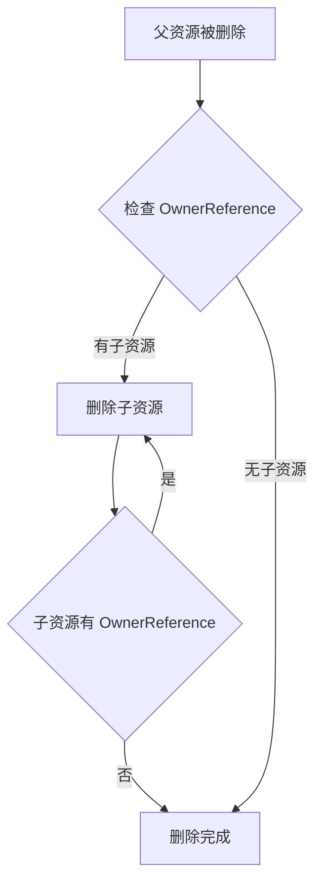

# OwnerReference 示例

OwnerReference 是 Kubernetes 中实现资源级联删除和父子关系的重要机制。本示例展示如何使用 OwnerReference。

## 什么是 OwnerReference？

### 作用

OwnerReference 用于建立资源之间的父子关系，当父资源被删除时，Kubernetes 会自动删除所有子资源（垃圾收集）。

### 工作原理



### 与 Finalizer 的区别

| 特性 | OwnerReference | Finalizer |
|------|----------------|-----------|
| 自动级联删除 | ✅ 是 | ❌ 否 |
| 删除顺序控制 | ❌ 有限 | ✅ 完全控制 |
| 外部资源清理 | ❌ 不支持 | ✅ 支持 |
| 使用场景 | 子资源管理 | 复杂清理逻辑 |
| 阻止删除 | ❌ 不阻止 | ✅ 阻止删除 |

## 示例代码

### 1. 设置 OwnerReference

#### 方法 1：使用 ControllerRef

```go
import (
    "k8s.io/apimachinery/pkg/types"
    "sigs.k8s.io/controller-runtime/pkg/controller/controllerutil"
)

func newPodForApp(app *mygroupv1.MyApp) *corev1.Pod {
    return &corev1.Pod{
        ObjectMeta: metav1.ObjectMeta{
            Name:      app.Name + "-pod",
            Namespace: app.Namespace,
            OwnerReferences: []metav1.OwnerReference{
                *metav1.NewControllerRef(app, mygroupv1.GroupVersion.WithKind("MyApp")),
            },
        },
        Spec: corev1.PodSpec{
            // ...
        },
    }
}
```

**要点**:
- `metav1.NewControllerRef()` 自动设置 OwnerReference
- 包含 UID、APIVersion、Kind、Controller 字段
- Controller=true 表示这是主要控制器

#### 方法 2：手动构建

```go
import (
    "k8s.io/apimachinery/pkg/types"
)

func newPodForApp(app *mygroupv1.MyApp) *corev1.Pod {
    return &corev1.Pod{
        ObjectMeta: metav1.ObjectMeta{
            Name:      app.Name + "-pod",
            Namespace: app.Namespace,
            OwnerReferences: []metav1.OwnerReference{
                {
                    APIVersion: "mygroup.example.com/v1",
                    Kind:       "MyApp",
                    Name:       app.Name,
                    UID:        app.UID,
                    Controller: &[]bool{true}[0],
                },
            },
        },
        Spec: corev1.PodSpec{
            // ...
        },
    }
}
```

#### 方法 3：更新现有资源

```go
func (r *MyReconciler) setOwnerReference(ctx context.Context, owner, obj client.Object) error {
    if err := controllerutil.SetControllerReference(owner, obj, r.Scheme); err != nil {
        return err
    }
    return r.Update(ctx, obj)
}
```

### 2. 查询子资源

#### 通过 OwnerReference 查询

```go
func (r *MyReconciler) listChildren(ctx context.Context, parent client.Object) ([]corev1.Pod, error) {
    // 方法 1：通过标签
    podList := &corev1.PodList{}
    if err := r.List(ctx, podList,
        client.InNamespace(parent.GetNamespace()),
        client.MatchingLabels(map[string]string{
            "app": parent.GetName(),
        }),
    ); err != nil {
        return nil, err
    }
    return podList.Items, nil

    // 方法 2：过滤 OwnerReference
    var children []corev1.Pod
    for _, pod := range podList.Items {
        for _, ownerRef := range pod.OwnerReferences {
            if ownerRef.UID == parent.GetUID() {
                children = append(children, pod)
                break
            }
        }
    }
    return children, nil
}
```

#### 使用字段选择器（注意：仅部分 API 支持）

```go
func (r *MyReconciler) listChildrenByUID(ctx context.Context, parent client.Object) ([]corev1.Pod, error) {
    podList := &corev1.PodList{}
    if err := r.List(ctx, podList,
        client.InNamespace(parent.GetNamespace()),
        client.MatchingFields{
            "metadata.ownerReferences.uid": string(parent.GetUID()),
        },
    ); err != nil {
        return nil, err
    }
    return podList.Items, nil
}
```

### 3. 防止孤儿资源

```go
func (r *MyReconciler) ensureOwnerReference(ctx context.Context, parent, child client.Object) error {
    // 检查是否已有正确的 OwnerReference
    hasOwner := false
    for _, ownerRef := range child.GetOwnerReferences() {
        if ownerRef.UID == parent.GetUID() {
            hasOwner = true
            break
        }
    }

    // 如果没有，添加 OwnerReference
    if !hasOwner {
        if err := controllerutil.SetControllerReference(parent, child, r.Scheme); err != nil {
            return err
        }
        if err := r.Update(ctx, child); err != nil {
            return err
        }
    }

    return nil
}
```

### 4. 多个 Owner

```go
func (r *MyReconciler) addMultipleOwners(obj client.Object, owners ...client.Object) error {
    refs := make([]metav1.OwnerReference, 0, len(owners))

    for _, owner := range owners {
        ref, err := reference.GetReference(r.Scheme, owner)
        if err != nil {
            return err
        }
        refs = append(refs, *ref)
    }

    obj.SetOwnerReferences(refs)
    return nil
}

// 使用
pod := newPod()
if err := r.addMultipleOwners(pod, app1, app2); err != nil {
    return err
}
```

### 5. 移除 OwnerReference

```go
func (r *MyReconciler) removeOwnerReference(obj client.Object, ownerUID types.UID) {
    refs := obj.GetOwnerReferences()
    newRefs := make([]metav1.OwnerReference, 0, len(refs))

    for _, ref := range refs {
        if ref.UID != ownerUID {
            newRefs = append(newRefs, ref)
        }
    }

    obj.SetOwnerReferences(newRefs)
}
```

### 6. 检查是否为控制器

```go
func isController(refs []metav1.OwnerReference, ownerUID types.UID) bool {
    for _, ref := range refs {
        if ref.UID == ownerUID {
            if ref.Controller != nil && *ref.Controller {
                return true
            }
        }
    }
    return false
}
```

## 完整示例

```go
import (
    "context"
    "fmt"

    corev1 "k8s.io/api/core/v1"
    "k8s.io/apimachinery/pkg/api/errors"
    "k8s.io/apimachinery/pkg/runtime"
    ctrl "sigs.k8s.io/controller-runtime"
    "sigs.k8s.io/controller-runtime/pkg/client"
    "sigs.k8s.io/controller-runtime/pkg/controller/controllerutil"
)

type AppReconciler struct {
    client.Client
    Scheme *runtime.Scheme
}

func (r *AppReconciler) Reconcile(ctx context.Context, req ctrl.Request) (ctrl.Result, error) {
    app := &appsv1.App{}
    if err := r.Get(ctx, req.NamespacedName, app); err != nil {
        return ctrl.Result{}, client.IgnoreNotFound(err)
    }

    // 处理删除
    if !app.DeletionTimestamp.IsZero() {
        return r.handleDeletion(ctx, app)
    }

    // 创建/更新 Pod，设置 OwnerReference
    pod := &corev1.Pod{
        ObjectMeta: metav1.ObjectMeta{
            Name:      fmt.Sprintf("%s-pod", app.Name),
            Namespace: app.Namespace,
            Labels: map[string]string{
                "app": app.Name,
            },
        },
        Spec: corev1.PodSpec{
            Containers: []corev1.Container{
                {
                    Name:  "app",
                    Image: app.Spec.Image,
                },
            },
        },
    }

    // 设置 OwnerReference
    if err := controllerutil.SetControllerReference(app, pod, r.Scheme); err != nil {
        return ctrl.Result{}, err
    }

    // 创建或更新 Pod
    existingPod := &corev1.Pod{}
    err := r.Get(ctx, client.ObjectKey{Namespace: pod.Namespace, Name: pod.Name}, existingPod)
    if err != nil {
        if errors.IsNotFound(err) {
            if err := r.Create(ctx, pod); err != nil {
                return ctrl.Result{}, err
            }
        }
        return ctrl.Result{}, err
    }

    // 更新 Pod（保持 OwnerReference）
    existingPod.Labels = pod.Labels
    if err := r.Update(ctx, existingPod); err != nil {
        return ctrl.Result{}, err
    }

    return ctrl.Result{}, nil
}

func (r *AppReconciler) handleDeletion(ctx context.Context, app *appsv1.App) (ctrl.Result, error) {
    // 使用 Finalizer 清理外部资源
    // 子资源（Pod）会自动被删除

    // ...
    return ctrl.Result{}, nil
}
```

## 最佳实践

### 1. Controller 标记

```go
// ✅ 正确：Controller=true
*metav1.NewControllerRef(app, appsv1.GroupVersion.WithKind("App"))

// ❌ 错误：Controller=false 或 nil
metav1.OwnerReference{
    UID:       app.UID,
    Controller: &[]bool{false}[0],
}
```

**原因**:
- Controller=true 表示这是主要控制器
- 影响垃圾收集行为
- 影响 Reconcile 触发（controller-runtime）

### 2. 结合 Finalizer

```go
func (r *AppReconciler) Reconcile(ctx context.Context, req ctrl.Request) (ctrl.Result, error) {
    app := &appsv1.App{}
    if err := r.Get(ctx, req.NamespacedName, app); err != nil {
        return ctrl.Result{}, client.IgnoreNotFound(err)
    }

    // 1. 处理删除（Finalizer）
    if !app.DeletionTimestamp.IsZero() {
        return r.handleFinalizer(ctx, app)
    }

    // 2. 添加 Finalizer
    if !controllerutil.ContainsFinalizer(app, finalizerName) {
        controllerutil.AddFinalizer(app, finalizerName)
        return r.Update(ctx, app)
    }

    // 3. 创建子资源（设置 OwnerReference）
    pod := newPodForApp(app)
    if err := controllerutil.SetControllerReference(app, pod, r.Scheme); err != nil {
        return ctrl.Result{}, err
    }

    return r.Create(ctx, pod)
}

func (r *AppReconciler) handleFinalizer(ctx context.Context, app *appsv1.App) (ctrl.Result, error) {
    // Finalizer: 清理外部资源
    if err := r.cleanupExternalResources(ctx, app); err != nil {
        return ctrl.Result{}, err
    }

    // 移除 Finalizer
    controllerutil.RemoveFinalizer(app, finalizerName)
    return r.Update(ctx, app)
}
```

**流程**:
1. 删除 App
2. Finalizer 阻止删除
3. 清理外部资源
4. 移除 Finalizer
5. OwnerReference 自动删除 Pod

### 3. 标签过滤

```go
func newPodForApp(app *appsv1.App) *corev1.Pod {
    return &corev1.Pod{
        ObjectMeta: metav1.ObjectMeta{
            Name:      app.Name + "-pod",
            Namespace: app.Namespace,
            Labels: map[string]string{
                "app":            app.Name,
                "app-uid":        string(app.UID),
                "managed-by":     "my-controller",
            },
        OwnerReferences: []metav1.OwnerReference{
            *metav1.NewControllerRef(app, appsv1.GroupVersion.WithKind("App")),
        },
        },
        Spec: corev1.PodSpec{
            // ...
        },
    }
}

// 查询时使用标签
func (r *AppReconciler) listPods(ctx context.Context, app *appsv1.App) ([]corev1.Pod, error) {
    podList := &corev1.PodList{}
    if err := r.List(ctx, podList,
        client.InNamespace(app.Namespace),
        client.MatchingLabels(map[string]string{
            "app": app.Name,
        }),
    ); err != nil {
        return nil, err
    }
    return podList.Items, nil
}
```

### 4. 版本检查

```go
func ensureOwnerReference(obj client.Object, owner client.Object, scheme *runtime.Scheme) error {
    refs := obj.GetOwnerReferences()

    // 检查是否已有 OwnerReference
    for i, ref := range refs {
        if ref.UID == owner.GetUID() {
            // 检查版本是否匹配
            if ref.APIVersion != owner.GetObjectKind().GroupVersionKind().GroupVersion().String() {
                // 版本不匹配，更新
                newRef, err := reference.GetReference(scheme, owner)
                if err != nil {
                    return err
                }
                refs[i] = *newRef
                obj.SetOwnerReferences(refs)
            }
            return nil
        }
    }

    // 添加新的 OwnerReference
    return controllerutil.SetControllerReference(owner, obj, scheme)
}
```

### 5. 错误处理

```go
func (r *AppReconciler) reconcilePod(ctx context.Context, app *appsv1.App) error {
    pod := newPodForApp(app)
    existingPod := &corev1.Pod{}

    err := r.Get(ctx, client.ObjectKeyFromObject(pod), existingPod)
    if err != nil {
        if errors.IsNotFound(err) {
            // 创建新 Pod
            if err := r.Create(ctx, pod); err != nil {
                return err
            }
            return nil
        }
        return err
    }

    // 更新现有 Pod
    // 注意：不要修改 OwnerReference
    existingPod.Spec = pod.Spec
    return r.Update(ctx, existingPod)
}
```

## 调试技巧

### 1. 查看 OwnerReference

```bash
kubectl get pod my-pod -o jsonpath='{.metadata.ownerReferences}'
```

### 2. 查看依赖关系

```bash
kubectl get pod my-pod -o yaml | grep -A 5 ownerReferences
```

### 3. 查看被依赖的资源

```bash
kubectl get all -o jsonpath='{range .items[*]}{.metadata.name}{"\t"}{.metadata.ownerReferences}{"\n"}{end}'
```

### 4. 查看删除事件

```bash
kubectl describe pod my-pod | grep -A 10 Events
```

## 常见问题

**Q: Pod 没有被删除？**

A:
1. 检查 OwnerReference 是否正确设置
2. 检查是否有 Finalizer 阻止删除
3. 查看 Controller 是否在运行

**Q: 如何移除 OwnerReference？**

A:
```bash
kubectl patch pod my-pod -p '{"metadata":{"ownerReferences":[]}}'
```

**Q: 多个 Controller 可以控制同一个资源吗？**

A: 不可以。Controller 标记为 true 的 OwnerReference 只能有一个。

## 参考资源

- [Kubernetes 垃圾收集文档](https://kubernetes.io/docs/concepts/architecture/garbage-collection/)
- [OwnerReference API 参考](https://kubernetes.io/docs/reference/kubernetes-api/common-definitions/object-meta/#v1-objectmeta)
